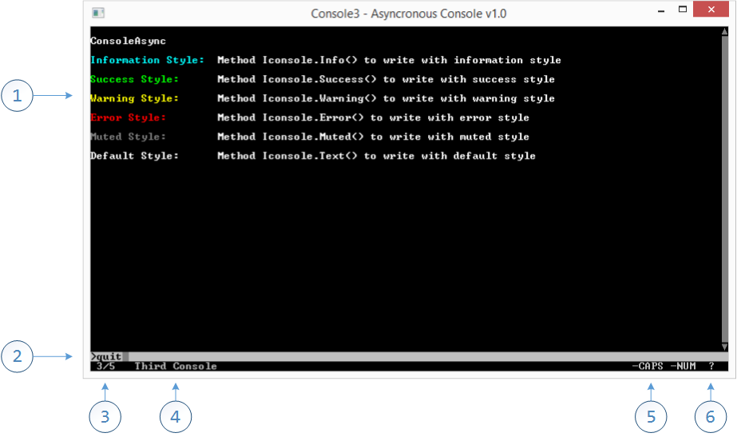

ConsoleAsync
------------------------------------------------------------------------
ConsoleAsync permits multiple console with multiple asyncronous worker, customized commands,
multiple colour text formats in the default C# Console Application

1. Mutiple writing styles
2. Customized user input
3. Multiple console
4. Name of visible console
5. CAPS/NUM State
6. Warning on update of non visible console

Read the [Documentation](documentation/summary.md) or visit [NuGet](http://www.nuget.org/packages/ConsoleAsync/1.0.0) page